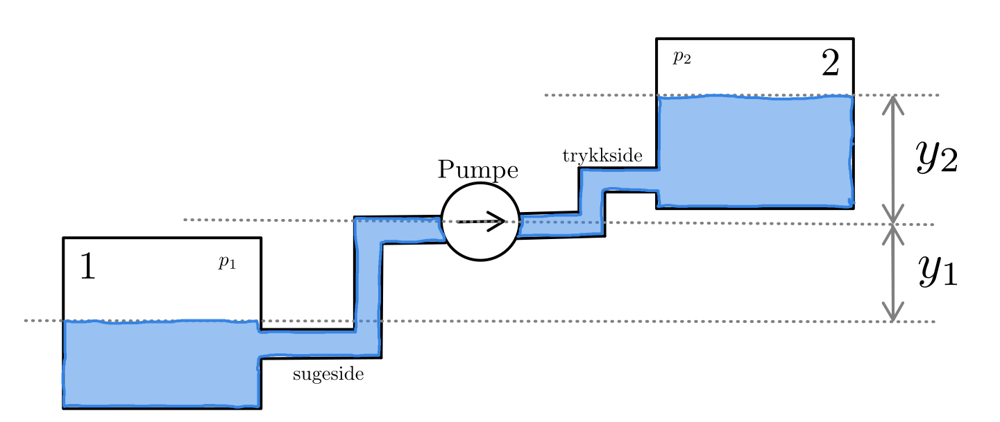

# Rørstrøm- og pumpekalkulator

Beregner volumstrøm, pumpehøyde og trykk for et system med to reservoarer og én pumpe.

Kalkulatoren anntar at reservoarene er såpass store at de har ingen hastighet.
Om ett av reservoarene er en buffertank med stor flow blir ikkje dette heilt nøyaktig. Om flowen i begge reservarene er lik blir det korrekt.

Om du vil ha fri flyt uten pumpe skriver du pumpeeffekten til 0

Her ligg formlane og eksempel om du vil rekna sjølv:
[Bernouillis ligningar](../formulas/bernoullis.md)

---

## Kalkulator

Vann: $\rho = 1000$    $\nu = 0.000001$

<link rel="stylesheet" href="../../assets/css/pipe-flow-calculator.css">

<!-- ── 1. Væske ─────────────────────────────────────────── -->

1 — Væske

  

    <label>Tetthet, ρ [kg/m³]</label>
    <input type="number" id="pf-rho" value="1000" min="0.001" step="1">
  

  

    <label>Kinematisk viskositet, ν [m²/s]</label>
    <input type="number" id="pf-nu" value="0.000001" min="1e-9" step="0.0000001">
  

<!-- ── 2. Pumpe ─────────────────────────────────────────── -->

2 — Pumpe

  

    <label>Pumpeeffekt inn, Pinn [kW]</label>
    <input type="number" id="pf-P_in" value="3.0" min="0" step="0.1">
  

  

    <label>Virkningsgrad, η [0–1]</label>
    <input type="number" id="pf-eta" value="0.70" min="0" max="1" step="0.01">
  

  Hydraulisk effekt: Phyd = η · Pinn. Sett Pinn = 0 for rent gravitasjons-/trykkdrevet strøm.

<!-- ── 3. Reservoar 1 ────────────────────────────────────── -->

3 — Reservoar 1

  

    <label>Trykk i reservoar 1, p₁ [Pa]</label>
    <input type="number" id="pf-p1" value="100000" step="1000">
  

  

    <label>Høyde reservoar 1 relativt til pumpe, y₁ [m]</label>
    <input type="number" id="pf-y1" value="-5" step="0.5">
  

  Positiv høyde = reservoaret er over pumpesentrum. Negativ = under.

<!-- ── 4. Sugeside ──────────────────────────────────────── -->

4 — Sugeside

  

    <label>Rørlengde [m]</label>
    <input type="number" id="pf-L_s" value="10" min="0" step="0.5">
  

  

    <label>Innv. diameter [mm]</label>
    <input type="number" id="pf-d_s" value="50" min="0.1" step="1">
  

  

    <label>Ruhet ε [mm]</label>
    <input type="number" id="pf-eps_s" value="0.046" min="0" step="0.001">
  

  

    <label>Tapskoeff. ζs [–]</label>
    <input type="number" id="pf-zeta_s" value="6" min="0" step="0.5">
  

<!-- ── 5. Trykkside ─────────────────────────────────────── -->

5 — Trykkside

  

    <label>Rørlengde [m]</label>
    <input type="number" id="pf-L_t" value="25" min="0" step="0.5">
  

  

    <label>Innv. diameter [mm]</label>
    <input type="number" id="pf-d_t" value="50" min="0.1" step="1">
  

  

    <label>Ruhet ε [mm]</label>
    <input type="number" id="pf-eps_t" value="0.046" min="0" step="0.001">
  

  

    <label>Tapskoeff. ζt [–]</label>
    <input type="number" id="pf-zeta_t" value="4" min="0" step="0.5">
  

<!-- ── 6. Reservoar 2 ────────────────────────────────────── -->

6 — Reservoar 2

  

    <label>Trykk i reservoar 2, p₂ [Pa]</label>
    <input type="number" id="pf-p2" value="100000" step="1000">
  

  

    <label>Høyde reservoar 2 relativt til pumpe, y₂ [m]</label>
    <input type="number" id="pf-y2" value="15" step="0.5">
  

<!-- ── Beregn-knapp ─────────────────────────────────────── -->
<button class="pf-btn" id="pf-btn">Beregn</button>

<!-- ── Resultater ────────────────────────────────────────── -->

  

  
Primærresultater

  

    

      
Volumstrøm

      
—

    

    

      
Volumstrøm

      
—

    

    

      
Pumpehøyde Hp

      
—

    

    

      
Trykk før pumpe

      
—

    

    

      
Trykk før pumpe

      
—

    

    

      
Trykk etter pumpe

      
—

    

    

      
Trykk etter pumpe

      
—

    

  

  
Detaljer — sugeside

  

    

      
Hastighet vs

      
—

    

    

      
Reynolds-tall Res

      
—

    

    

      
Friksjonsfaktor fs

      
—

    

    

      
Tapshøyde sugeside

      
—

    

  

  
Detaljer — trykkside

  

    

      
Hastighet vt

      
—

    

    

      
Reynolds-tall Ret

      
—

    

    

      
Friksjonsfaktor ft

      
—

    

    

      
Tapshøyde trykkside

      
—

    

  

  
Systemhøyder

  

    

      
Statisk høydeforskjell (y₂ − y₁)

      
—

    

    

      
Trykkbidrag (p₂ − p₁)/(ρg)

      
—

    

  

<!-- ── Forutsetninger ────────────────────────────────────── -->

  <strong>Forutsetninger:</strong> Stasjonær strømning &nbsp;·&nbsp; Inkompressibel væske &nbsp;·&nbsp;
  Hastighet i reservoarene = 0 &nbsp;·&nbsp; Én konstant rørdimensjon og én samlet tapskoeffisient per side &nbsp;·&nbsp;
  Darcy-Weisbach for rørfriksjon (Swamee-Jain eksplisitt formel) &nbsp;·&nbsp; Ingen kavitasjonssjekk

---

## Referanseverdier

### Rørruhet

Typiske verdier for innvendig ruhet $\varepsilon$:

| Material | Ruhet $\varepsilon$ (mm) |
|----------|--------------------------|
| Betong, grov | 0.25 |
| Betong, glatt | 0.025 |
| Plastikk (PVC, PE) | 0.003 |
| Støpejern, ny | 0.25 |
| Støpejern, rusta | 1.0 |
| Stål, valsa | 0.05 |
| Stål, rusta | 0.3 |
| Aluminium | 0.03 |

### Lokaltapskoeffisienter

Den samlede tapskoeffisienten $\zeta$ for hver side er summen av alle komponenters $\zeta$-bidrag:

$$\zeta_{\text{total}} = \sum_i \zeta_i$$

Typiske verdier:

| Komponent | Utforming | $\zeta$ |
|-----------|-----------|---------|
| Utløp (rør → reservoar) | Skarpkantet | 1.0 |
| Utløp (rør → reservoar) | Avrundet | 1.0 |
| Innløp (reservoar → rør) | Skarpkantet | 0.5 |
| Innløp (reservoar → rør) | Avrundet | 0.04 |
| Bend 90° | Skarpkantet | 1.0 |
| Bend 90° | Liten krumning | 0.2 |
| Kuleventil | Åpen | 0.05 |
| Kuleventil | 1/3 lukket | 5.5 |
| Kuleventil | 2/3 lukket | 200 |

**Eksempel — sugeside** med skarpkantet innløp + ett 90°-bend (skarpkantet):

$$\zeta_s = 0{,}5 + 1{,}0 = 1{,}5$$

Legg til bidrag for alle komponenter i rørstrekket. Utløpstapet (1.0) regnes normalt på trykksiden.

---

## Fysisk modell

Systemet består av to reservoarer forbundet med en pumpe:

$$\text{Reservoar 1} \;\to\; \text{sugerør} \;\to\; \text{pumpe} \;\to\; \text{trykkreør} \;\to\; \text{Reservoar 2}$$

Energibalansen mellom de frie overflatene (Bernoulli med pumpe og tap):

$$\frac{p_1}{\rho g} + y_1 + H_p = \frac{p_2}{\rho g} + y_2 + h_{f,s} + h_{e,s} + h_{f,t} + h_{e,t}$$

| Symbol | Beskrivelse |
|--------|-------------|
| $p_1, p_2$ | Trykk i reservoar 1 og 2 |
| $y_1, y_2$ | Høyde reservoar 1 og 2 relativt til pumpesentrum |
| $H_p$ | Pumpehøyde |
| $h_{f,s},\ h_{f,t}$ | Darcy-Weisbach friksjonshøyde, suge- og trykkside |
| $h_{e,s},\ h_{e,t}$ | Samlet lokaltap, suge- og trykkside |

### Friksjonsfaktor

Laminar ($Re < 2300$):

$$f = \frac{64}{Re}$$

Turbulent — Swamee-Jain:

$$f = \frac{0{,}25}{\left[\log_{10}\!\left(\dfrac{\varepsilon}{3{,}7\,d} + \dfrac{5{,}74}{Re^{0{,}9}}\right)\right]^2}$$

### Tapshøyder

$$h_f = f \cdot \frac{L}{d} \cdot \frac{v^2}{2g} \qquad h_e = \zeta \cdot \frac{v^2}{2g}$$

### Pumpehøyde fra effekt og strøm

$$P_{\text{hyd}} = \eta \cdot P_{\text{inn}} \qquad H_p = \frac{P_{\text{hyd}}}{\rho g Q}$$

### Trykk ved pumpeinngangen

Bernoulli fra reservoar 1 til pumpeinngang:

$$p_{\text{sug}} = p_1 + \rho g y_1 - \tfrac{1}{2}\rho v_s^2 - \rho g (h_{f,s} + h_{e,s})$$

### Løsningsmetode

Definer residualet $F(Q) = H_p(Q) - H_{\text{req}}(Q)$. Finn $Q > 0$ slik at $F(Q) = 0$ ved hjelp av biseksjonsmetoden.

---

