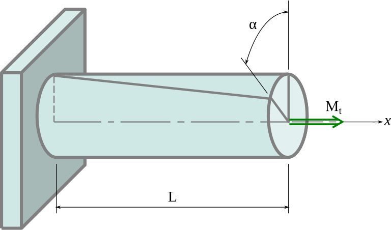

# Vridning av en aksel
Berekner vridning / tvist av en aksel under torsjon.

---


Bilde: https://snl.no/torsjon
---

## Formel

$$
\huge \phi = \dfrac{M_v \cdot l}{I_p \cdot G}
$$

---

## Variabler
$\phi =$ Vinkelen i radianer
$M_v =$ Dreiemomentet ($Nmm$)
$l =$ lengden ($mm$)
$I_p =$ Polart arealmoment (andre polare arealmoment) ($mm^4$)
$G =$ Skjærmodul (E-modul for skjær) (MPa)
---

## Enheter og antagelser
Vinkelen må være i radianer.
Enheter kan og være i SI enheter.

Her finn du meir info om [Treghetsmoment og Motstandsmoment](../notes/treghetsmoment-motstandsmoment.md)

Ca verdier for vanlige material:

| Material  | Skjærmodul               |
| --------- | ------------------------ |
| Stål S355 | $8 \cdot 10^4 \ MPa$     |
| Aluminium | $25-28 \cdot 10^4 \ MPa$ |
| PE        | $120 \, MPa$             |
| Treverk   | $4 \cdot 10^3 \ MPa$     |

PS. selv med herding osv endres ikkje E-modul og skjærmodul veldigt så for serviettmatematikk bør detta vera godt nok.

Formlar og forkalring for treghetsmoment finn du her: [Treghetsmoment og Motstandsmoment](../notes/treghetsmoment-motstandsmoment.md)

---

## Eksempel

En 40mm aksel i stål er 1 meter lang og blir påført 100Nm vrimoment.

$M_v = 100000 \, Nmm$)
$l = 1000 \, mm$)
$I_p = 251327 mm^4$)
$G =8 \cdot 10^4 \ MPa$

$\large \phi = \dfrac{M_v \cdot l}{I_p \cdot G}$

$\large \phi = \dfrac{100000 \, Nmm$ \cdot 1000 \, mm}{251327 \cdot 8 \cdot 10^4 \ MPa} \, \approx \, 5.0 \cdot 10^{-2} Rad \approx 0.285°$

---

## For copy/paste


**Markdown / Latex:**
```Markdown
$$
\large \phi = \dfrac{M_v \cdot l}{I_p \cdot G}
$$
```

---
